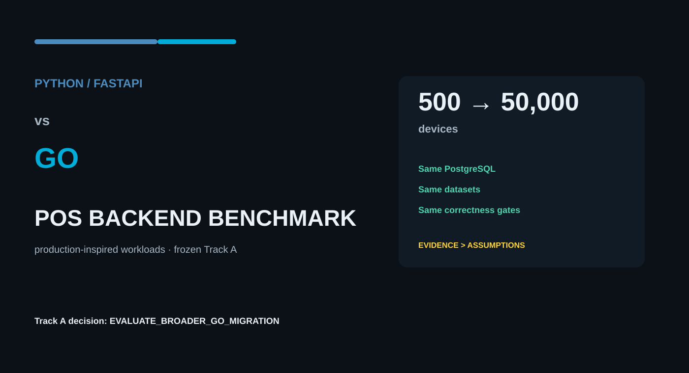
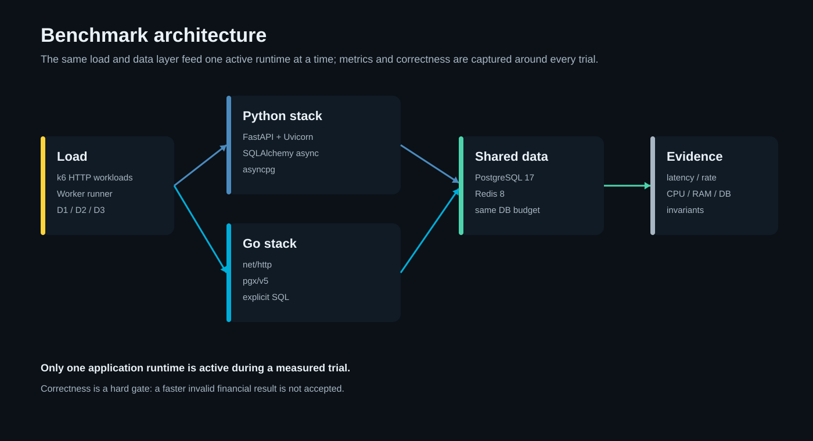
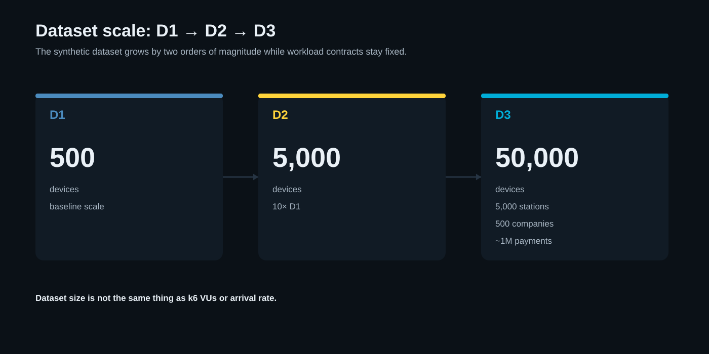
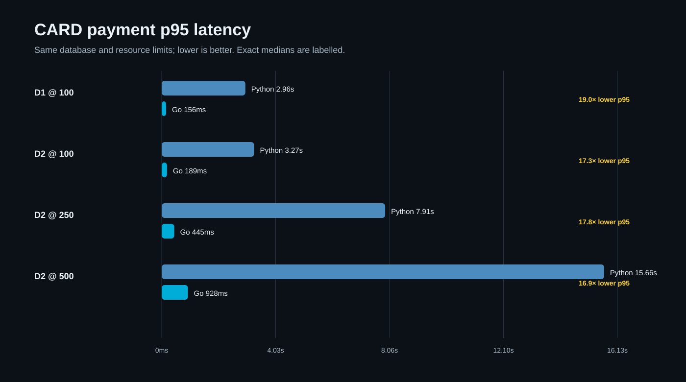
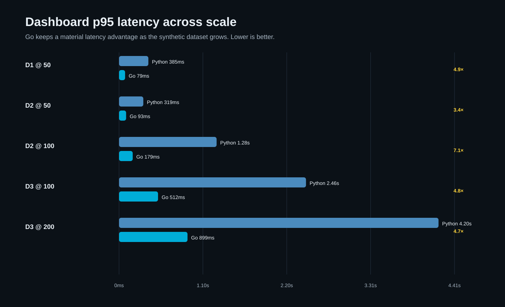
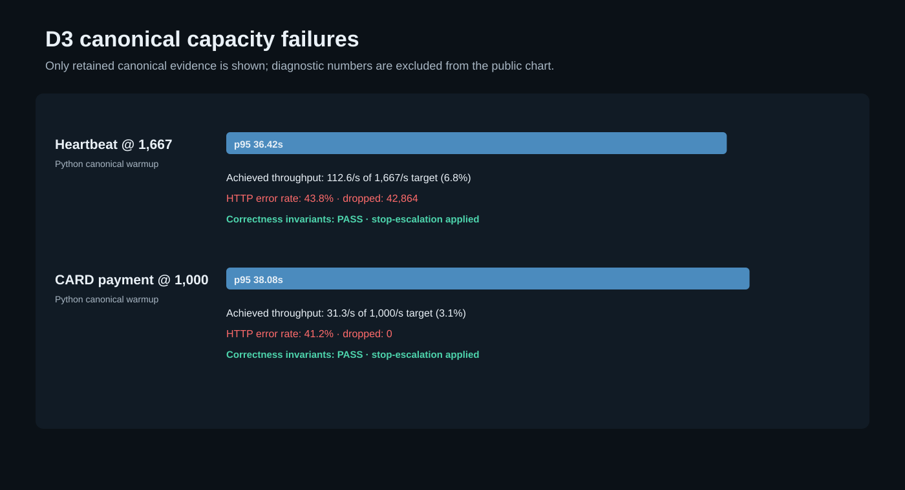
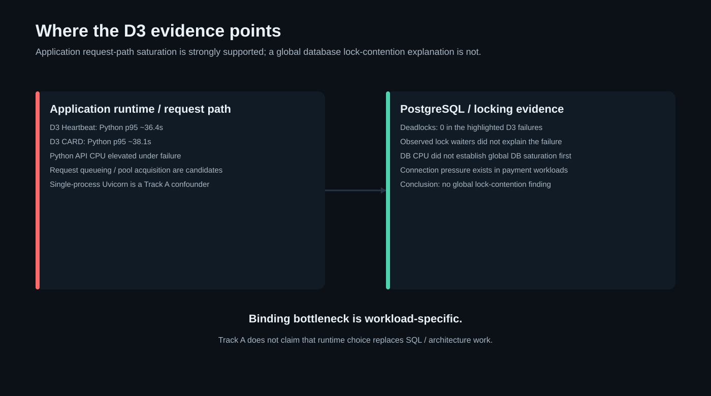
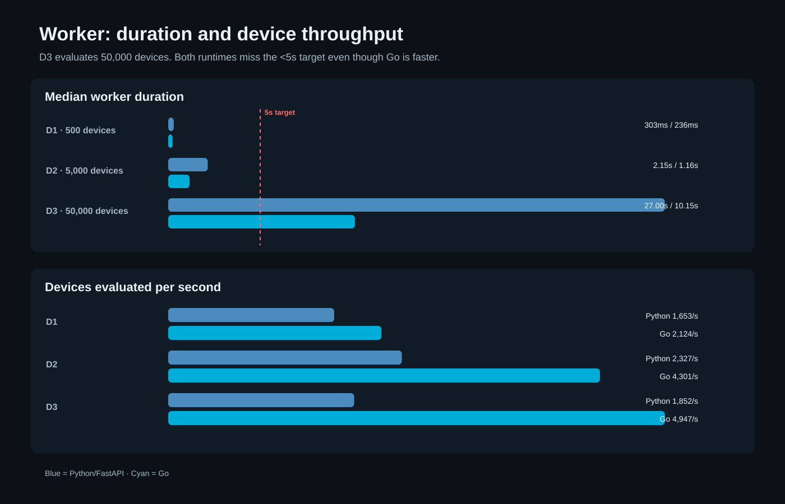
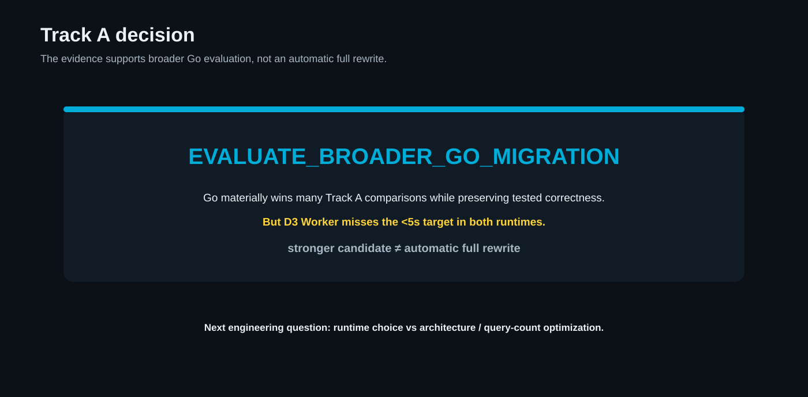

# I Knew Go Would Be Faster. I Wanted to Know by How Much.

**Benchmarking Python/FastAPI and Go under production-inspired POS workloads, from 500 to 50,000 devices.**

Figure caption: Python/FastAPI and Go compared under the same production-inspired POS benchmark model, scaling from 500 to 50,000 devices.

Alt text: Dark technical illustration introducing a Python versus Go POS backend benchmark across three dataset scales.

Go was already the leading architectural candidate for a backend project I am working on.

That made the obvious benchmark question almost useless.

I did not need another synthetic microbenchmark telling me that a compiled Go program could execute a tight loop faster than Python. I also did not want to turn the decision into a language-war post where one runtime “wins” because of a single endpoint measured on a laptop.

The question I actually cared about was narrower and more practical:

**If I model the kinds of workloads this backend will need to handle, how large is the gap between a Python/FastAPI stack and a Go stack — and where does that gap stop being a language problem and start becoming an architecture problem?**

So I built a separate benchmark repository around a **production-inspired POS backend workload**.

The benchmark includes device traffic, payment transactions, contention, dashboard reads, command lifecycle processing, and a device-evaluation Worker. Both implementations use the same PostgreSQL database, the same Redis service, the same synthetic data, the same correctness expectations, and the same resource budgets.

The result was not simply “Go won.”

Go was materially faster across many of the scenarios I cared about. In some payment workloads, the difference was an order of magnitude. At D3, Python also reached an application-side capacity wall before the evidence supported a database-wide lock-saturation explanation.

But Go did not make every problem disappear. The 50,000-device Worker still missed its target by a wide margin. Some extreme D3 scenarios failed before a paired canonical comparison could even be completed. Query count, batching, and ingestion architecture still matter.

That distinction is the most useful thing I got from the experiment.

---

## The System I Wanted to Model

This repository does not copy a specific production backend, and it does not contain customer or production data.

Instead, it models patterns that matter in a POS-style backend:

- devices sending heartbeat traffic;
- devices fetching configuration;
- card payment creation with transactional guarantees;
- QR and RF payment contention;
- idempotency-sensitive operations;
- dashboard queries over a growing dataset;
- command lifecycle updates;
- a background Worker evaluating device state and opening alarms.

That is deliberately different from benchmarking “hello world” HTTP handlers.

In a real backend, the runtime is only one part of the path. Requests touch connection pools, SQL, transactions, locks, serialization, the event loop or scheduler, network I/O, and application state. A useful benchmark has to preserve enough of those costs that the result still resembles the engineering decision you are trying to make.

Figure caption: The benchmark drives one application runtime at a time against shared PostgreSQL and Redis services, while collecting application, database, lock, trial, and correctness evidence.

Alt text: Diagram showing k6 or a Worker calling either the Python/FastAPI stack or Go stack, both connected to PostgreSQL and Redis with metrics and invariant checks collected alongside them.

The two application stacks were:

**Python**

- Python 3.12
- FastAPI
- SQLAlchemy async
- asyncpg
- Redis async client
- Uvicorn

**Go**

- `net/http`
- `pgx/v5`
- explicit SQL
- Redis client

The database, dataset, SQL/transaction behavior, correctness gates, pool ceiling, and resource limits were held fixed under Track A.

---

## Frozen Track A: I Did Not Tune the Winner Mid-Benchmark

One of the easiest ways to ruin a language comparison is to optimize whichever side looks bad as soon as the first results arrive.

I wanted Track A to answer a specific question: **what happens when these two frozen application stacks are run under the same workload model?**

That meant no mid-matrix tuning such as:

- increasing Uvicorn worker count;
- adding uvloop;
- disabling Python access logging;
- changing the DB pool;
- rewriting SQL after seeing a slow result;
- removing the Worker’s intentional per-device query pattern;
- adding Go-specific architecture optimizations.

The measured matrix used two warmups per runtime, alternating Python→Go and Go→Python blocks, a minimum of five measured trials, and continuation up to ten measured trials if p95 coefficient of variation remained above 10%.

When variation was still above that threshold at the maximum, the result was marked `UNSTABLE` rather than quietly reporting only the best run.

Correctness was also a hard gate. A faster payment implementation was not useful if it could double-spend or violate idempotency.

This benchmark compares these two frozen application stacks under these workloads. It does not measure the theoretical performance limit of either Python or Go.

That sentence is important enough to repeat later.

---

## D1, D2, and D3

The synthetic dataset grows by an order of magnitude at each step:

- **D1:** 500 devices
- **D2:** 5,000 devices
- **D3:** 50,000 devices

At D3, the dataset also includes 5,000 stations, 500 companies, and roughly one million historical payment rows.

Figure caption: The deterministic benchmark profiles scale from 500 devices at D1 to 50,000 at D3, with D3 adding 5,000 stations, 500 companies, and about one million payment rows.

Alt text: Three-stage scale diagram showing D1 at 500 devices, D2 at 5,000 devices, and D3 at 50,000 devices with larger station, company, and payment counts.

The point was not merely to create a “large database.” It was to see how the same application paths degrade as the state they operate on becomes less trivial.

---

## The First Result That Made the Gap Concrete: CARD

The CARD payment path became one of the clearest examples.

At **D1 CARD @100**, the median p95 values were:

- Python stack: **~2.96 seconds**
- Go stack: **~156 milliseconds**

That is roughly a **19x latency difference for this specific workload**.

Figure caption: CARD payment median p95 latency across D1 and D2 load levels. The exact values are derived from the retained benchmark evidence.

Alt text: Horizontal comparison chart showing Python CARD p95 latency substantially above Go at D1 load 100 and D2 loads 100, 250, and 500.

The more interesting part is that the difference did not disappear when I increased the D2 CARD load.

At D2:

| CARD load | Python median p95 | Go median p95 |
|---:|---:|---:|
| 100 | ~3.27 s | ~189 ms |
| 250 | ~7.91 s | ~445 ms |
| 500 | ~15.66 s | ~928 ms |

At CARD @500, that is still roughly a 17x p95 difference for this scenario.

This is why I do not summarize the experiment with a generic claim about one language being faster than another. The useful statement is tied to a workload, a load level, and a metric.

The benchmark also records throughput, application CPU/RAM, PostgreSQL CPU/RAM, connection state, statement counts, WAL deltas, and lock evidence. Latency is the easiest number to visualize, but the bottleneck classification needs the rest of the evidence.

---

## Dashboard Scaling Told a Similar Story

Dashboard reads are a different shape from payment writes. They do not exercise exactly the same transaction path, so I wanted to know whether the Go advantage would narrow as the database became the larger part of the request.

At D3, it did narrow relative to the most extreme CARD ratios — but it remained large.

At **Dashboard @100**:

- Python median p95: **~2.46 s**
- Go median p95: **~512 ms**

At **Dashboard @200**:

- Python median p95: **~4.20 s**
- Go median p95: **~899 ms**

That is roughly a 4–5x p95 difference in both D3 dashboard levels.

Figure caption: Dashboard median p95 latency across D1, D2, and D3. The Go stack keeps a material latency advantage as the dataset grows.

Alt text: Horizontal latency chart comparing Python and Go dashboard p95 values across multiple D1, D2, and D3 load levels, with Go consistently lower.

The database is more visible here. PostgreSQL CPU becomes meaningful in these dashboard runs. That matters because it prevents an overly simple conclusion that every difference is purely language runtime overhead.

A real system can have different binding constraints in different workloads.

---

## D3 Heartbeat: Where Python Hit a Capacity Wall

D3 is where the benchmark stopped feeling like a normal latency comparison.

At **D3 Heartbeat @1667**, the canonical Python warmup failed the scenario gate.

The observed evidence included:

- p95: **~36.42 s**
- achieved throughput: **~112.6 req/s**
- HTTP error rate: **~43.8%**
- dropped iterations: **42,864**
- correctness invariants: **PASS**

The requested arrival rate and achieved throughput were no longer close enough for the result to be treated as a normal measured matrix.

The canonical stop-escalation rule applied, so the next heartbeat level was not run as if nothing had happened.

Figure caption: Canonical D3 capacity failures retained in the public evidence package. Only publishable canonical evidence is shown.

Alt text: Dark chart showing Python canonical capacity failures for D3 heartbeat and card payment, including high p95 latency, low achieved throughput relative to target, and error rates while correctness still passes.

What mattered most to me was *why* it failed.

The evidence did **not** show a global PostgreSQL lock-contention collapse:

- no deadlocks;
- no meaningful lock waiter pattern explaining the failure;
- PostgreSQL CPU below what would support “the DB is fully saturated” as the global explanation;
- severe queueing on the application path.

That makes the Python application/request path a much stronger binding-constraint candidate at this point: single-process Uvicorn, the event loop, request queueing, connection-pool acquisition, and other application-side overhead are all plausible contributors.

I also ran separate diagnostic probes during the investigation. Because their raw numeric artefacts are not retained in the public evidence package, I do not publish those numbers here. The public article stays limited to claims that can be traced to retained evidence.

That evidence discipline matters more than having one extra dramatic number in a chart.

---

## D3 CARD: The Database Pool Starts to Matter Too

The D3 CARD path produced another canonical capacity failure at **CARD @1000**.

Python warmup evidence:

- p95: **~38.08 s**
- achieved throughput: **~31.3 req/s**
- HTTP error rate: **~41.2%**
- correctness invariants: **PASS**

This case also showed connection pressure: the application DB pool ceiling was 40 and the workload reached that pressure point.

But again, lock evidence did not support a simple “PostgreSQL lock contention caused everything” explanation.

That distinction changes the migration discussion. If PostgreSQL were consistently saturating first while Python sat mostly idle, rewriting the application language would be a weak response. Instead, the benchmark shows several important scenarios where the application stack becomes binding before there is evidence of a database-wide saturation condition.

Figure caption: Track A bottleneck interpretation distinguishes application request-path evidence, database pressure, and the absence of a global lock-contention conclusion.

Alt text: Diagram separating Python application saturation evidence from PostgreSQL connection and CPU pressure, with an explicit note that global database lock contention was not established as the primary bottleneck.

This still does not mean “PostgreSQL is irrelevant.” It means the bottleneck is workload-specific and the migration decision should reflect that.

---

## The Worker Is the Best Counterexample to “Just Rewrite It in Go”

If I wanted to write a simplistic benchmark post, I could stop after the payment and dashboard results.

The Worker is why I should not.

At D3, the Worker evaluates **50,000 devices**.

Median duration:

- Python: **~27.00 s**
- Go: **~10.15 s**

Median evaluation rate:

- Python: **~1,852 devices/s**
- Go: **~4,947 devices/s**

So Go is materially faster in this specific Worker implementation.

But the target is **under 5 seconds**.

Both fail it.

Figure caption: D3 Worker duration and device throughput. Go improves the frozen implementation substantially, but both runtimes remain over the five-second target.

Alt text: Two-panel chart comparing Python and Go Worker duration and devices per second, showing Go faster while both D3 durations remain beyond the target line.

The Worker intentionally preserves a per-device/query-count pattern under Track A. I did not replace it with batching or a set-based query because that would mix a language comparison with an architecture optimization.

This is exactly where Track B becomes interesting.

A set-based Worker, fewer database round trips, better batching, or a different state-evaluation design could move the result more than another runtime-level optimization.

That is not a failure of the benchmark. It is one of its most useful outputs: **Go reduces the runtime cost, but it does not erase an inefficient workload shape.**

---

## Correctness Was a Hard Gate, Not a Footnote

A payment benchmark is meaningless if the fastest implementation is also the one that corrupts money state.

The accepted Track A runs preserved the hard-gate invariants used for the benchmark, including:

- no duplicate payment;
- no QR double redemption;
- no RF double spend;
- no negative wallet or duplicate debit;
- no idempotency mismatch;
- no illegal command transition;
- no partial financial commit;
- Worker alarm correctness.

The contention cases are particularly important here. QR and RF workloads were not merely “requests per second” tests; they were also attempts to prove that the faster path still respected the same transactional outcome.

Performance evidence was accepted only when those correctness checks remained valid.

---

## Fairness: The Stacks Are Not Perfectly Symmetric

This is the section I would want to read before trusting any Python-versus-Go benchmark.

The two stacks are behaviorally aligned for the benchmark, but they are not mechanically identical.

The Python side uses:

- single-process Uvicorn;
- default access logging;
- no uvloop;
- FastAPI + SQLAlchemy async + asyncpg.

The Go side uses:

- `net/http`;
- `pgx/v5` with explicit SQL;
- no equivalent per-request access log;
- a five-second handler context timeout.

I did not remove those asymmetries after seeing results because Track A was intentionally frozen.

That creates confounders.

For example, a tuned Python Track B could test:

- multiple Uvicorn workers;
- uvloop;
- access-log changes;
- pool tuning;
- query changes.

Likewise, Go could be changed architecturally in ways that improve or hurt its results.

So the fair interpretation is not:

> “Python can never do this.”

It is:

> “Under these frozen application stacks and these workloads, the Go implementation has a large and repeated performance advantage, and the D3 evidence makes the Python request path a credible binding constraint in important scenarios.”

That is a much narrower claim — and much more useful for an engineering decision.

The stored k6 summaries do not include p99. No p99 value is inferred in this article.

---

## What This Benchmark Does Not Prove

It does not prove that every backend should be rewritten in Go.

It does not prove the theoretical maximum capacity of FastAPI or Python.

It does not prove the theoretical maximum capacity of Go.

It does not prove that PostgreSQL will never become the bottleneck.

It does not prove that a language migration fixes N+1/query-count problems.

It does not prove that the D3 design targets are automatically safe once the runtime changes.

It does not provide a currency-denominated infrastructure-cost comparison because the benchmark does not include a monetary pricing model.

And it does not reproduce a particular company’s production system.

The repository is deliberately framed as a **production-inspired POS benchmark** so that the workload model can be inspected and reproduced without publishing proprietary implementation details or real data.

---

## My Conclusion: EVALUATE_BROADER_GO_MIGRATION

The final Track A decision is:

**`EVALUATE_BROADER_GO_MIGRATION`**

Figure caption: The Track A decision is to evaluate a broader Go migration, while explicitly separating that recommendation from an automatic full rewrite.

Alt text: Decision card reading EVALUATE_BROADER_GO_MIGRATION with a note that a stronger Go candidacy does not equal an automatic full rewrite.

Why not simply `KEEP_PYTHON`?

Because the observed differences are repeatedly much larger than the benchmark’s “small difference” band. Payment and dashboard scenarios show material latency gaps, and D3 provides evidence that the Python request path can become binding before PostgreSQL is globally saturated.

Why not simply `KEEP_PYTHON_OPTIMIZE_DB`?

Because the database is not the only binding constraint supported by the evidence.

Why not conclude “rewrite everything in Go”?

Because the Worker and extreme D3 targets show that query shape and architecture still matter. Migration scope has to be driven by workload value, operational risk, delivery cost, and the actual bottleneck of each subsystem.

For me, the benchmark changed the question.

Before the experiment, the question was:

**“Is Go’s performance advantage meaningful enough to matter?”**

After Track A, the more useful question is:

**“Which backend paths benefit enough from Go to justify migration first, and which paths need architecture work regardless of language?”**

That is a much better place to make a design decision from.

---

## What I Would Test in Track B

Track A intentionally froze both implementations.

Track B should answer a different question:

**How much of the remaining gap comes from runtime choice, and how much comes from architecture?**

The experiments I would separate clearly from Track A include:

- Python runtime tuning;
- multiple Uvicorn workers;
- uvloop;
- access-log changes;
- set-based Worker queries;
- batching;
- fewer DB round trips;
- heartbeat ingestion redesign;
- Go architecture optimization;
- before/after query-count and PostgreSQL evidence.

The important rule is not to merge optimized Track B numbers back into Track A charts. They answer different questions.

---

## Reproduce the Benchmark on GitHub

The full benchmark repository includes:

- Python and Go implementations;
- Docker Compose environment;
- PostgreSQL schema and deterministic seed profiles;
- k6 workloads;
- correctness gates;
- orchestration scripts;
- normalized Track A summary;
- compact public evidence;
- chart source CSVs;
- publication charts and diagrams;
- methodology and limitations.

The public reproduction mode is self-contained and does not require access to the private source repository used to establish the original historical provenance.

**GitHub repository:** the live repository URL will be inserted into the Medium editor after the public GitHub release is verified.

If you reproduce the benchmark, I would be especially interested in two things: whether the same degradation curves appear on different hardware, and what happens when the Worker/query architecture is changed under a separately labelled Track B.

The headline result is useful.

The boundary between **runtime bottleneck** and **architecture bottleneck** is more useful.
