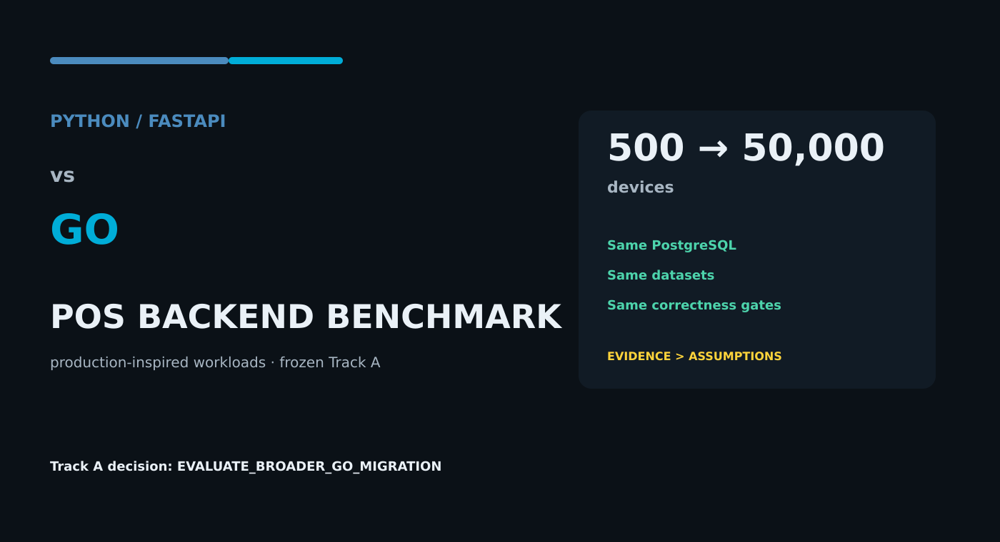
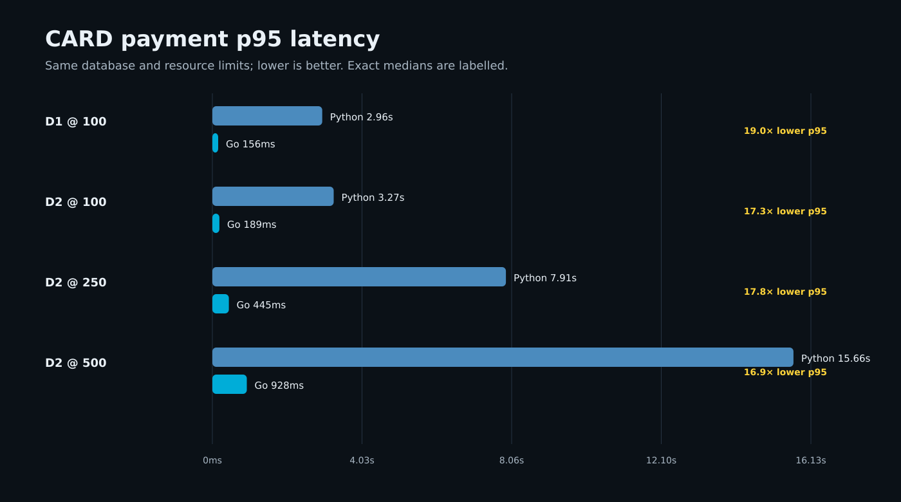
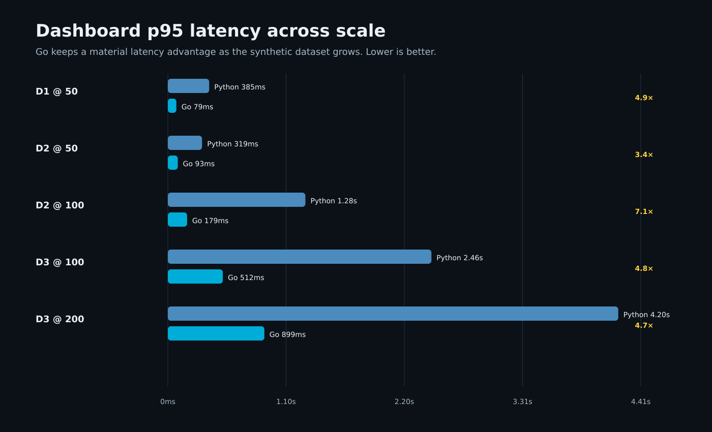
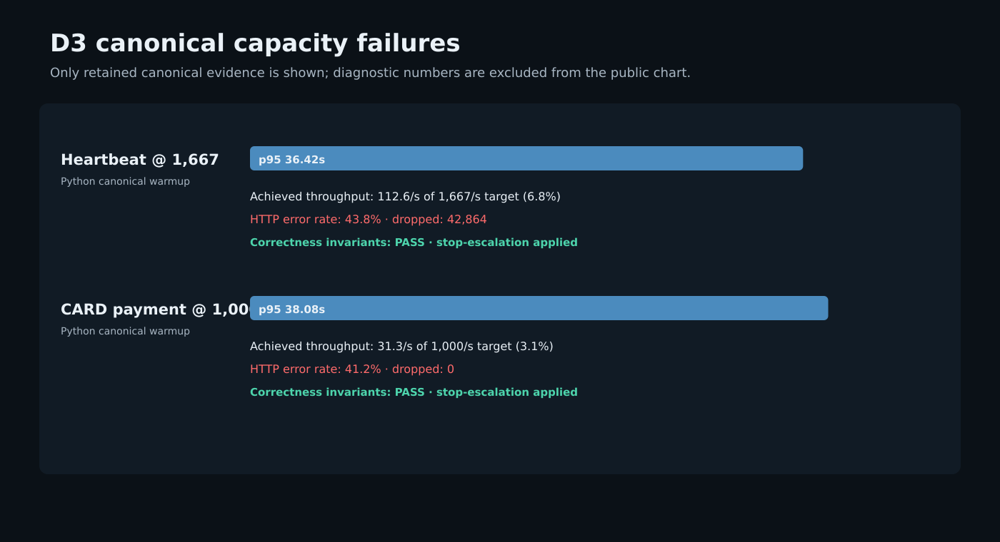
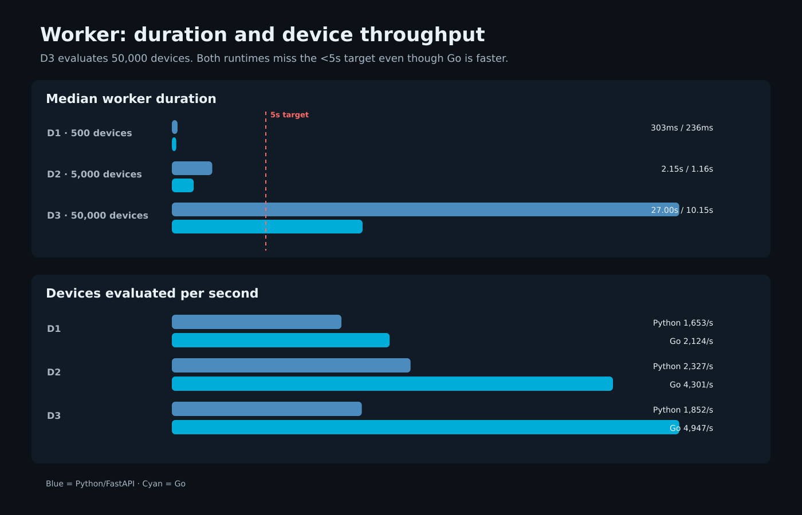

# Python vs Go POS Backend Benchmark: Results from 500 to 50,000 Devices

Figure caption: Python/FastAPI and Go compared under the same production-inspired POS benchmark model, scaling from 500 to 50,000 devices.

Alt text: Dark technical illustration introducing a Python versus Go POS backend benchmark across three dataset scales.

Go has been on my shortlist for new backend projects for a while. Its strengths around concurrency and resource usage are well known. Python/FastAPI, meanwhile, is a stack we already use and know well.

So the question was not whether Go would be faster.

I wanted to know how large the difference would become once the workload started to resemble a real backend.

A gap between 10 ms and 15 ms rarely changes an architecture decision. A gap that turns into seconds under payment traffic, dashboard queries, or thousands of devices sending requests is a different story.

To measure that, I built a separate benchmark project.

I did not copy our production system or use real customer data or proprietary code. Instead, I created production-inspired workloads around operations you would normally expect in a POS backend:

- Heartbeat
- Configuration
- Card payment
- QR and RF contention
- Dashboard queries
- Command lifecycle
- Background Worker

The Python and Go implementations ran against the same PostgreSQL instance, the same dataset, the same resource limits, and the same correctness rules.

As the load increased, the differences became much easier to see.

By the time the benchmark reached 50,000 devices, it was also showing something more useful than a simple Python-versus-Go comparison: which bottlenecks belonged to the application stack, and which belonged to the architecture itself.

## Test environment

I used three dataset sizes:

- D1: 500 devices
- D2: 5,000 devices
- D3: 50,000 devices

D3 also contains 5,000 stations, 500 companies, and roughly one million historical payment records.

Python stack:

- Python 3.12
- FastAPI
- SQLAlchemy async
- asyncpg
- Uvicorn

Go stack:

- `net/http`
- `pgx/v5`
- explicit SQL

Application containers were limited to 2 CPUs and 1 GiB of RAM. PostgreSQL had 4 CPUs and 4 GiB of RAM.

The DB pool ceiling was 40 on both sides.

Only the runtime being measured was active during a benchmark run.

Another important rule was not to optimize either stack after seeing the results.

When Python performed poorly, I did not increase the worker count, add `uvloop`, or change logging settings. I also did not make query or architecture optimizations on the Go side.

I called this phase **Track A**: two frozen stacks under the same conditions.

Correctness was also mandatory. A run was not accepted if it produced duplicate payments, double spending, idempotency problems, or partial financial commits.

## The gap showed up early in the CARD tests

The first large gap appeared in the CARD tests.

At D1 CARD @100:

| Stack | Median p95 |
|---|---:|
| Python | ~2.96 s |
| Go | ~156 ms |

For this workload, the p95 latency difference was about **19x**.

The same pattern continued at D2:

| CARD load | Python p95 | Go p95 |
|---:|---:|---:|
| 100 | ~3.27 s | ~189 ms |
| 250 | ~7.91 s | ~445 ms |
| 500 | ~15.66 s | ~928 ms |

At CARD @500, Python reached roughly 15.7 seconds while Go was still below one second.

That does not justify a general claim that Go is 19x faster overall.

The result is narrower than that: **with these frozen stacks and these CARD workloads, the p95 gap reached roughly 17x to 19x.**

Figure caption: CARD payment median p95 latency across D1 and D2 load levels.

Alt text: Horizontal comparison chart showing Python CARD p95 latency substantially above Go at D1 load 100 and D2 loads 100, 250, and 500.

## The difference was smaller on dashboard workloads

Dashboard traffic produced a different result.

Here, a larger part of the total response time comes from the database, so the runtime has less influence over the full request.

At D3 Dashboard @100:

- Python: ~2.46 s
- Go: ~512 ms

At D3 Dashboard @200:

- Python: ~4.20 s
- Go: ~899 ms

The difference here is around **4x to 5x**.

That is much smaller than the CARD gap, but it is still significant.

More importantly, it shows why a single "Python vs Go" number is not very useful.

The request path matters.

As more of the response time moves into PostgreSQL, the runtime becomes a smaller part of the total cost.

Figure caption: Dashboard median p95 latency at D3 load levels 100 and 200.

Alt text: Comparison chart showing Python and Go dashboard p95 latency at D3, with Go lower at both measured load levels.

## Heartbeat reached a capacity limit at 50,000 devices

D3 was where the benchmark stopped looking like a normal latency comparison.

At Heartbeat @1667, the canonical Python warmup failed the scenario gate:

- p95: ~36.42 s
- achieved throughput: ~112.6 req/s
- HTTP error rate: ~43.8%
- dropped iterations: 42,864
- correctness: PASS

The difference between the requested arrival rate and the throughput actually achieved was too large to treat this as a normal paired comparison.

According to the benchmark plan, I did not continue to the next heartbeat load level.

What PostgreSQL was doing during the failure was more interesting.

There were no deadlocks. There was no meaningful lock-waiter pattern. PostgreSQL CPU was also not high enough to suggest that the database as a whole had saturated.

The application side, however, showed clear queueing.

Based on the available evidence, the Python request path had become an important binding constraint at this point.

That cost should not be attributed to the Python language alone. Single-process Uvicorn, the event loop, request queueing, DB connection acquisition, and framework/runtime overhead all sit on the same path.

So I would not summarize this as "Python is bad."

But the evidence also does not support explaining the failure as a PostgreSQL-only bottleneck.

Figure caption: Canonical D3 Python capacity failures retained in the public benchmark evidence.

Alt text: Chart showing D3 heartbeat and CARD capacity failures with high p95 latency, reduced achieved throughput, and elevated error rates while correctness remains passing.

## The connection pool also came under pressure at CARD @1000

The D3 CARD @1000 test exposed a slightly different limit.

Python failed the scenario gate again:

- p95: ~38.08 s
- throughput: ~31.3 req/s
- HTTP error rate: ~41.2%
- correctness: PASS

This time, DB pool pressure was much more visible. The application pool ceiling was 40, and the workload reached that limit.

So the runtime was not the only factor. Connection pressure was real as well.

Even then, global lock contention did not appear to be the main explanation.

This matters for the migration decision.

If PostgreSQL had been the first hard limit in every heavy workload, moving to another language would have been much harder to justify.

That is not what Track A showed.

On some request paths, the application stack itself became a serious limit before the database did.

## The Worker pointed to a different kind of problem

The Worker result was different.

At 50,000 devices, the results were:

| Stack | Median duration | Throughput |
|---|---:|---:|
| Python | ~27.00 s | ~1,852 devices/s |
| Go | ~10.15 s | ~4,947 devices/s |

Go was about **2.66x** faster.

But the target was under 5 seconds.

Neither implementation met it.

Here, the runtime change was not enough.

The Worker kept its per-device query pattern throughout Track A. I intentionally did not switch to batching or set-based queries after seeing the results.

Doing that would have mixed a language benchmark with an architecture optimization.

In production, though, this is exactly the kind of path I would optimize first.

At 50,000 devices, reducing DB round trips, batching work, or moving to set-based queries could make a major difference regardless of whether the application is written in Python or Go.

Figure caption: D3 Worker duration and throughput at 50,000 devices.

Alt text: Chart comparing Python and Go Worker duration and devices per second, with Go faster while both remain above the five-second target.

## Speed was not enough on its own

Performance numbers were only accepted if the implementation remained correct.

For payment workloads in particular, accepted Track A runs had to preserve all of the following invariants:

- no duplicate payment
- no QR double redemption
- no RF double spend
- no negative wallet
- no duplicate debit
- no idempotency mismatch
- no illegal command transition
- no partial financial commit

Worker alarm checks were also verified separately.

A faster implementation was only useful if it produced the same transactional outcome.

## Benchmark limitations

The two implementations are not perfectly symmetrical.

Python side:

- single-process Uvicorn
- default access logging
- no `uvloop`
- FastAPI
- SQLAlchemy async
- asyncpg

Go side:

- `net/http`
- `pgx/v5`
- explicit SQL
- no equivalent per-request access logging
- 5-second handler context timeout

I do not ignore the effect these differences may have on the results.

This benchmark does not measure the maximum capacity of Python. It does not measure the theoretical maximum of Go either.

This benchmark compares these two frozen application stacks under these workloads. It does not measure the theoretical performance limit of either Python or Go.

**Track A only compares two defined, frozen application stacks under the same workloads.**

For Python, natural Track B candidates include multiple Uvicorn workers, `uvloop`, logging changes, and pool tuning.

For the Worker and heartbeat workloads, runtime tuning and architecture changes also need to be measured separately.

The stored k6 summaries do not contain p99 values, so I did not estimate or publish p99 numbers.

## Conclusion

The decision at the end of Track A was:

`EVALUATE_BROADER_GO_MIGRATION`

That does not mean the entire backend should immediately be rewritten in Go.

The results do, however, make a simple `KEEP_PYTHON` decision difficult to justify.

The payment workloads show the largest gap.

Dashboard workloads narrow that gap as the dataset grows and more of the request cost moves into the database, but the difference remains substantial.

At D3, heartbeat and CARD both begin to expose serious application-path capacity limits.

The Worker is the counterexample: moving to a faster runtime helps, but it does not solve the underlying query pattern.

Migration should be evaluated workload by workload.

Request paths where runtime cost is clearly high are stronger candidates for Go.

Paths dominated by DB round trips, N+1 patterns, or poor query shape need architecture work regardless of the language.

## Repository

Benchmark repository:

https://github.com/ferhatsli/python-vs-go-pos-benchmark

The repository includes:

- both implementations
- Docker Compose environment
- PostgreSQL schema
- deterministic dataset profiles
- k6 workloads
- correctness checks
- normalized results
- chart source data

The public reproduction mode does not require access to the private source repository.

The next step is **Track B**.

There I want to measure Python runtime tuning separately from Worker and ingestion architecture optimizations.

That should make it possible to compare the gain from language migration with the gain from architecture changes without mixing the two.
